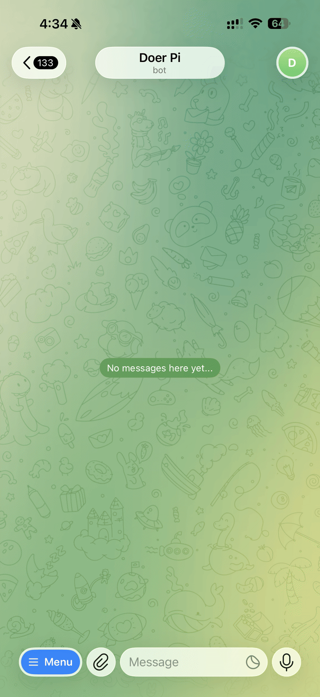

# Telegram Bot for Pi Coding Agent


A private Telegram control surface for people who already use Pi locally and want both live remote prompting and scheduled automation from their phone. It is designed as a lightweight OpenClaw-like system for a single user and a single workspace: you can create and select Pi sessions, send prompts, monitor progress, and schedule one-time or recurring runs without exposing your machine through a public web app.

Telegram works well here because it's fast on mobile, has reliable push notifications, and gives you a familiar command/chat UX from anywhere.

**Pi** is a local coding-agent runtime/SDK that runs sessions on your machine and executes work in your configured workspace.

## Security model (by design)

- exactly one authorized Telegram user ID can use the bot
- Pi runs on your local machine only
- there is no hosted web dashboard in this project

## What this project is not

- not a multi-user bot
- not a group-chat bot
- not a remote-hosted SaaS control plane
- not a replacement for Pi setup/auth (Pi must already work locally)

> Status: MVP for a single-user, single-workspace workflow.

## What it does

- runs Pi locally with no separate web service
- restricts access to one Telegram user ID
- keeps one selected session active and persists that selection across restarts
- lets you change the current session's active conversation model with `/model`
- supports `/new`, `/sessions`, `/current`, `/rename`, `/status`, and `/abort`
- supports interactive scheduling with `/schedule`, `/schedules`, `/unschedule`, and `/runscheduled`
- can transcribe private Telegram voice notes and audio uploads through an opt-in Whisper-style STT service, then send the returned transcript as a normal Pi prompt
- accepts private Telegram photos and supported image documents as direct image prompts
- saves supported plain-text documents under the system temp directory and has Pi read them from disk
- saves supported PDFs and office documents under the system temp directory and routes them through `pi-docparser`
- registers the Telegram command menu on startup
- streams replies back into Telegram and falls back to plain text if Markdown formatting is rejected
- keeps a pinned `Active session:` message in sync when the active session has a title
- creates a quick heuristic title for new sessions, then optionally refines it in the background
- uses server-local timezone scheduling with one-time and recurring runs plus automatic 1-minute retry while foreground work is busy

## Quick start (60 seconds)

```bash
bun install
cp .env.example .env
```

Set required vars in `.env`:

- `TELEGRAM_BOT_TOKEN`
- `TELEGRAM_AUTHORIZED_USER_ID`
- `PI_WORKSPACE_PATH`

Run the bot:

```bash
bun run dev
```

In Telegram, message your bot:

```text
/new
```

## Requirements

- Node.js 20.10+
- Bun for dependency install and project scripts
- a Telegram bot token from BotFather
- your numeric Telegram user ID
- a local Pi setup that already works on this machine
- network reachability from the bot host to the configured speech-to-text service if you opt into Telegram voice-note or audio transcription
- the `pi-docparser` Pi package installed in the same Pi environment the bot uses if you want parser-backed PDF or office-document uploads
- LibreOffice installed if you want parser-backed Office or spreadsheet uploads on macOS/Linux

This project does not log you into Pi or configure provider credentials for you. Pi must already be usable through the Pi SDK before this bot starts.

## Tested on

- macOS
- Node.js v24.11.1
- Bun 1.3.12
- `@mariozechner/pi-coding-agent` ^0.70.2

## Installation and setup

Run all commands from the repository root.

### 1. Install dependencies

```bash
bun install
cp .env.example .env
```

### 2. Create the Telegram bot with BotFather

1. Open Telegram and start a chat with [@BotFather](https://t.me/BotFather).
2. Send `/newbot`.
3. Pick a display name for the bot.
4. Pick a username that ends with `bot`.
5. Copy the token BotFather returns.
6. Put that token into `.env` as `TELEGRAM_BOT_TOKEN`.

No manual Telegram command-menu setup is required. The app calls `setMyCommands` on startup.

### 3. Get your Telegram user ID

You need your own numeric user ID for `TELEGRAM_AUTHORIZED_USER_ID`.

Common ways to get it:

- message [@userinfobot](https://t.me/userinfobot) and copy the numeric ID it returns
- or send a message to your bot, then inspect `https://api.telegram.org/bot<YOUR_BOT_TOKEN>/getUpdates` and use the private-chat `from.id` value

Use your personal numeric ID, not your `@username` and not the bot's ID.

### 4. Configure `.env`

At minimum, set:

- `TELEGRAM_BOT_TOKEN`
- `TELEGRAM_AUTHORIZED_USER_ID`
- `PI_WORKSPACE_PATH`

Example:

```dotenv
TELEGRAM_BOT_TOKEN=replace-with-your-botfather-token
TELEGRAM_AUTHORIZED_USER_ID=123456789
PI_WORKSPACE_PATH=/absolute/path/to/your/pi-workspace
BOT_STATE_PATH=./data/state.json
```

Optional voice/audio STT setup:

```dotenv
TELEGRAM_STT_ENABLED=true
TELEGRAM_STT_BASE_URL=http://10.24.200.204:8000
# Optional overrides:
# TELEGRAM_STT_ENDPOINT_PATH=/transcribe
# TELEGRAM_STT_MODEL=whisper-1
# TELEGRAM_STT_PROMPT=Transcribe the user's Telegram audio exactly and return only the transcript.
# TELEGRAM_STT_API_KEY=
# TELEGRAM_STT_TIMEOUT_MS=60000
```

### 5. Start the bot

Development:

```bash
bun run dev
```

Built run:

```bash
bun run build
bun run start
```

### 6. Optional parser-backed document setup

If you want Telegram PDF or Office uploads to use Pi's parser-backed document path, install the Pi package in the same Pi environment the bot uses:

```bash
pi install npm:pi-docparser
```

For Office or spreadsheet formats such as `.docx`, `.pptx`, or `.xlsx`, install LibreOffice as a host dependency too:

```bash
brew install --cask libreoffice
```

PDF parsing does not normally require LibreOffice.

## Configuration reference

### Env-file loading behavior

The app force-loads an env file at startup.

1. If `PI_TELEGRAM_BOT_ENV_PATH` is set in the parent environment, that file is loaded.
2. Otherwise the project `.env` file is loaded.
3. Values from the loaded file overwrite inherited shell or service environment variables with the same names.
4. If the selected env file is missing or unreadable, startup fails immediately.

Important: do not set `PI_TELEGRAM_BOT_ENV_PATH` inside `.env`. That value has to exist before the app decides which env file to read.

### Environment variables

| Variable | Required | Purpose | Notes |
| --- | --- | --- | --- |
| `TELEGRAM_BOT_TOKEN` | Yes | Telegram bot token from BotFather. | Startup fails if missing. |
| `TELEGRAM_AUTHORIZED_USER_ID` | Yes | Numeric Telegram user ID allowed to use the bot. | Must be a positive integer. |
| `PI_WORKSPACE_PATH` | Yes | Workspace controlled by the bot. | Must point to an existing directory. |
| `BOT_STATE_PATH` | No | Local JSON file for selected-session, pin, and model-recency metadata. | Defaults to `./data/state.json`. |
| `PI_AGENT_DIR` | No | Optional Pi agent directory override. | Leave blank to use the Pi SDK default for this machine. |
| `PI_SESSION_TITLE_REFINEMENT_MODEL` | No | Background-only model for session-title refinement. | Defaults to `openai/gpt-5.4-mini`; provider-qualified values are recommended. |
| `TELEGRAM_STREAM_THROTTLE_MS` | No | Minimum delay between streamed reply updates. | Default `1000`, minimum `250`. |
| `TELEGRAM_CHUNK_SIZE` | No | Max characters per Telegram message chunk. | Default `3500`, valid range `512` to `4000`. |
| `TELEGRAM_STT_ENABLED` | No | Opts into Telegram voice-note and audio transcription. | STT stays unconfigured unless this is explicitly set to `true`. |
| `TELEGRAM_STT_BASE_URL` | No | Base URL for the Whisper-style STT service. | Used only when STT is enabled. Defaults to `http://10.24.200.204:8000`. |
| `TELEGRAM_STT_ENDPOINT_PATH` | No | Endpoint path appended to the STT base URL. | Used only when STT is enabled. Defaults to `/transcribe`. |
| `TELEGRAM_STT_MODEL` | No | Model value sent to the STT service. | Used only when STT is enabled. Defaults to `whisper-1`. Override to `whisper` if your service expects that name. |
| `TELEGRAM_STT_PROMPT` | No | Generic prompt sent with each STT request. | Used only when STT is enabled. Defaults to `Transcribe the user's Telegram audio exactly and return only the transcript.` |
| `TELEGRAM_STT_API_KEY` | No | Optional bearer token for the STT service. | Used only when STT is enabled. Leave blank for the current local service. |
| `TELEGRAM_STT_TIMEOUT_MS` | No | Timeout for each STT request. | Used only when STT is enabled. Default `60000`, minimum `1000`. |

Relative paths resolve from the current working directory. If you run the app from the repo root, the default `BOT_STATE_PATH=./data/state.json` stays inside this project.

## Daily Telegram usage

Use the bot from the authorized private Telegram account.

Available commands:

- `/start`
- `/help`
- `/status`
- `/new`
- `/sessions`
- `/current`
- `/rename`
- `/model`
- `/abort`
- `/schedule`
- `/schedules`
- `/unschedule`
- `/runscheduled`

Behavior notes:

- any non-command text message is sent to the selected session
- private Telegram voice notes and audio uploads are transcribed through the configured speech-to-text service and the returned transcript is sent as a normal text prompt when STT is enabled
- private Telegram photos and supported image documents are sent to Pi with the image attached
- supported plain-text documents (`.txt`, `.md`, `.json`, `.csv`, `.tsv`, `.log`) are staged under the system temp directory and read from disk by Pi
- supported PDFs and office documents are staged under the system temp directory and routed through `pi-docparser`
- if no session is selected yet, the first freeform text message or supported upload creates one automatically
- `/sessions` shows recent sessions and inline buttons for selecting
- selecting a session from `/sessions` also resends that session's last persisted assistant reply when one exists
- `/model` opens an inline picker for actually available models for the current session's active conversation model
- `/model` shows recently used models first for the current workspace
- `/model` does not change the separate background title-refinement model
- while a run is active, new prompts, `/new`, session selection changes, and model changes are rejected until the run finishes or you use `/abort`
- `/rename` opens a cancelable rename prompt for the selected session
- unsupported documents or parser-unready `pi-docparser` environments fail explicitly

## Scheduled tasks

The bot includes a built-in interactive scheduler so you can queue work for later or create recurring automation without relying on OS cron. This is intended to make the bot a lightweight OpenClaw-like system for a single local Pi workspace.

Scheduler commands:

- `/schedule` — start the interactive schedule flow
- `/schedules` — list current scheduled tasks
- `/unschedule` — open an interactive menu to delete a scheduled task
- `/runscheduled` — open an interactive menu to run a scheduled task now

`/schedule` is a guided flow:

1. choose where the scheduled prompt should run:
   - new session
   - current session
2. answer `When should this run?`
3. confirm the normalized interpretation
4. provide the prompt text

Every step includes a cancel path.

Supported schedule examples include:

- `in 10 minutes`
- `tomorrow at 5am`
- `2026-05-01 8:30pm`
- `every tuesday at 8pm`
- `every 5 minutes`
- `every hour`
- `every month`

Important scheduler behavior:

- all schedule parsing and display uses the **server local timezone** of the machine running the bot
- recurring schedules support minute, hour, day, week, and month intervals
- scheduled runs send **concise summary results**, not live streamed progress messages
- if a foreground Pi run is active when a scheduled task becomes due, the task is delayed by **1 minute** and retried until the bot is idle
- overdue one-time tasks run once after restart
- if you choose current session during scheduling, that session is frozen into the task at creation time

`/unschedule` and `/runscheduled` both use interactive paginated menus:

- 5 tasks per page
- first page shows only `Next page`
- last page shows only `Last page`
- middle pages show both
- selection must be confirmed before delete/run
- every menu includes a cancel button

## Demo

This demo shows the core flow:

1. `/new`
2. send a prompt
3. `/status`
4. `/sessions`
5. `/abort`



## Local-only files and repo hygiene

The public repo is meant to keep secrets and runtime output out of version control.

- `.env` is local-only and should never be committed
- `node_modules/` and `dist/` are generated output
- `data/` stores local selected-session and pin state
- `tmp/` stores local temporary diagnostics only

Telegram upload staging uses the system temp directory for per-upload files and cleans those files up after the Pi prompt settles.

The included `.gitignore` excludes those paths for public upload.

## macOS service setup

This repo includes user-level `launchd` scripts for macOS.

Install and verify the LaunchAgent:

```bash
bun run build
bun run service:install
bun run service:status
```

The installed LaunchAgent:

- is written to `~/Library/LaunchAgents/com.doer.pi-telegram-bot.plist`
- runs `node dist/index.js`
- sets `PI_TELEGRAM_BOT_ENV_PATH` to the project `.env`
- writes logs under `~/Library/Logs/pi-telegram-bot/`
- starts at login with `RunAtLoad`

Daily service commands:

```bash
bun run service:start
bun run service:stop
bun run service:restart
bun run service:uninstall
```

Service caveats:

- rebuild before `service:restart` after code changes
- rerun `service:install` after LaunchAgent config changes such as a moved Node binary or updated log path
- run the service commands from a logged-in macOS desktop session
- the bundled service flow is not for Linux, Windows, or root-daemon use

Useful log checks:

```bash
tail -f ~/Library/Logs/pi-telegram-bot/stdout.log
tail -f ~/Library/Logs/pi-telegram-bot/stderr.log
```

## Architecture at a glance

- `src/index.ts` loads env, validates config, and wires the app together
- `src/config/*` resolves and validates env-driven configuration
- `src/pi/*` creates Pi SDK runtimes and handles background title refinement
- `src/session/*` owns session selection, busy-state enforcement, and prompt routing
- `src/telegram/*` handles commands, reply streaming, formatting, and session-pin sync
- `src/state/*` persists local bot-owned state
- `scripts/*` and `launchd/*` manage the optional macOS LaunchAgent

## Troubleshooting

### `Unauthorized user.`

`TELEGRAM_AUTHORIZED_USER_ID` is wrong, not numeric, or belongs to a different Telegram account.

### `Failed to load project env file`

The selected env file is missing or unreadable. Check `.env` or the parent-shell value of `PI_TELEGRAM_BOT_ENV_PATH`.

### Workspace or agent-dir path errors

`PI_WORKSPACE_PATH` and `PI_AGENT_DIR`, when set, must point to existing directories.

### The bot is busy

Only one Pi run can be active at a time. Wait for completion or use `/abort`.

### Parser-backed document uploads fail immediately

Check these in order:

1. `pi install npm:pi-docparser` was run in the same Pi environment the bot uses.
2. The current Pi environment actually registers the `document_parse` tool.
3. For Office or spreadsheet files, LibreOffice is installed (`brew install --cask libreoffice` on macOS).

Plain-text uploads still use the normal file-read path, but PDFs and other parser-backed documents require a working `pi-docparser` package/tool environment before they are sent to Pi.

### Voice notes or audio uploads fail immediately

Check these in order:

1. `TELEGRAM_STT_ENABLED=true` is set explicitly. STT is unconfigured by default.
2. `TELEGRAM_STT_BASE_URL`, `TELEGRAM_STT_ENDPOINT_PATH`, and `TELEGRAM_STT_MODEL` still match the service you intend to use.
3. The bot host can reach the STT service at the configured URL.

If STT is disabled or not configured, the bot replies with: `Speech to text is not configured. Please configure it first.`

### The service does not start

Check these in order:

1. `bun run build` completed successfully.
2. `.env` exists and is correct.
3. `bun run service:status` shows the installed LaunchAgent.
4. `~/Library/Logs/pi-telegram-bot/stderr.log` contains the real startup error.

## Verification

```bash
bun run build
bun run typecheck
bun run test
```
